## Assignment 1 MAE 5510 - Anna Schaldenbrand
 
## How to Run
 
Download files and run `assignment_1.py`.

The code will print `"Assignment 1 script complete!"` when finished.

**Est. time to run script:** 13 min.

The writeup is called `assignment_1_writeup.md`.

The produced graphs are saved/rewritten in the file's folder.
 
---
 
## 1. Sanity Checks
 
### Check 1: Aggressive Forward Initial Velocity

**Initial Conditions:** θ₀ = 0 rad, θ̇₀ = 3 rad/s, γ = 5°, N = 10
 
**Expected:**

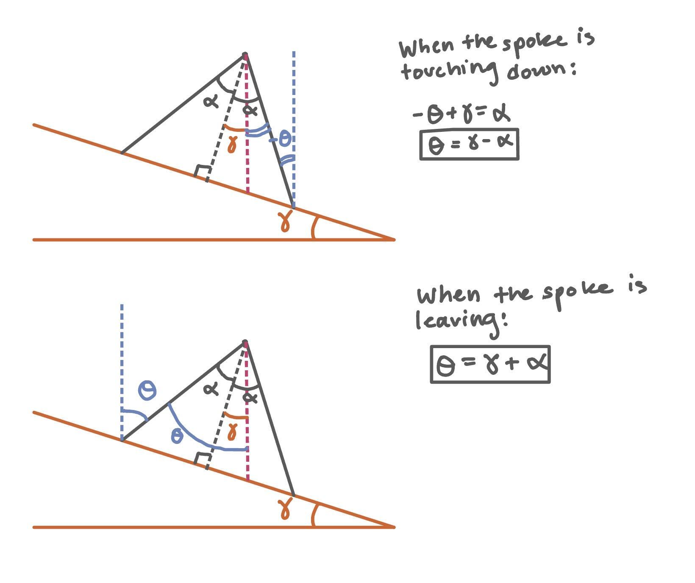
 
Theta should oscillate between γ + α and γ - α because of the bounds set on impact. Ideally, with an agressive initial forward angular velocity, the system should settle to rolling forward and we should see the system settle out to a postive limit cycle.
 
**What happened:**
 
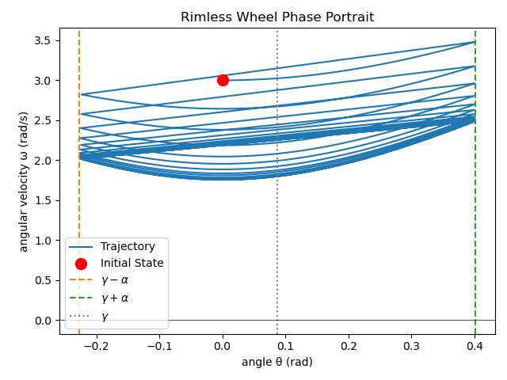

Theta did oscillate as expected between γ + α and γ - α, meaning impact is triggered correctly. The impact looks like a sharp "bounce" which matches the bouncing behavior of the bouncing ball. The angular velocity also decays to a lower stable positive limit cycle, which is consistent with the inelastic collision behavior which loses energy at impact.
 
---
 
### Check 2: Aggressive Backward Initial Velocity
 
**Initial Conditions:** θ₀ = 0 rad, θ̇₀ = -3 rad/s, γ = 5°, N = 10

**Expected:**
 
Starting with an agressive backward velocity, the wheel should roll backward for possibly a cycle as it slows down and then reverse direction and start rolling forward. It will either come to rest (go to zero angular velocity) or start rolling forward (settle at the rolling foward limit cycle).
 
**What happened:**
 
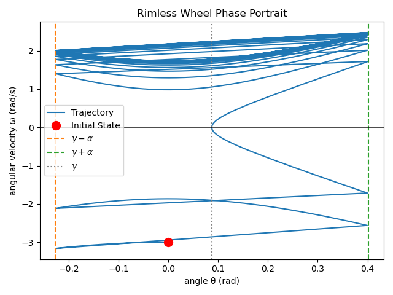

The wheel did start with a negative angular velocity indicating it was rolling backward. That behavior quickly decayed and the angualr velocity switched directions to the point where the wheel was rolling forward. It then settled out into the rolling forward limit cycle (consistent with Check 1).
 
---
 
### Check 3: Out of Bounds Initial Theta

**Initial Conditions:** θ₀ = 3 rad, θ̇₀ = 3 rad/s, γ = 5°, N = 10
 
**Expected:**
 
The reset logic should fire immediately since the initial theta is too high and will correct until it is within bounds (see diagram in Check 1). It should subtract 2*alpha until it is within the bounds of theta. Then the wheel will act normal until it settles into either rest or rolling forward stability.
 
**What happened:**
 
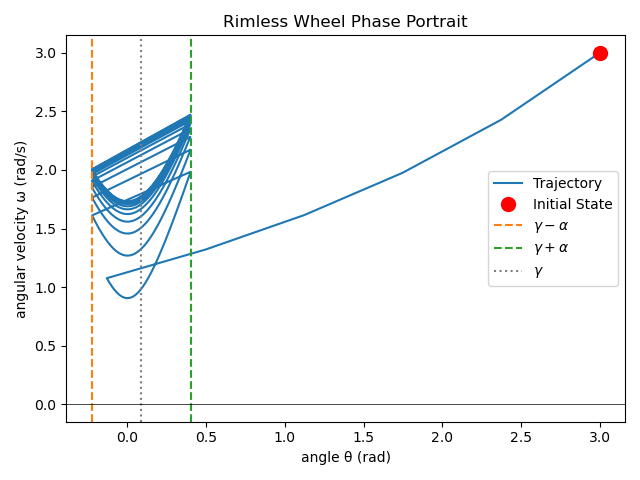

This matched what was expected since it did correct the theta until it was within bounds and then settled into forward rolling stability.
 
---
 
### Check 4: Comes to Rest with Zero Inclination

**Initial Conditions:** θ₀ = 0 rad, θ̇₀ = 3 rad/s, γ = 0°, N = 10
 
**Expected:**
 
Starting even with an initial velocity, if the inclination of the ramp is 0 degrees, it will come to rest since the wheel will run out of energy and the gravitational force is normal to the ramp.
 
**What happened:**

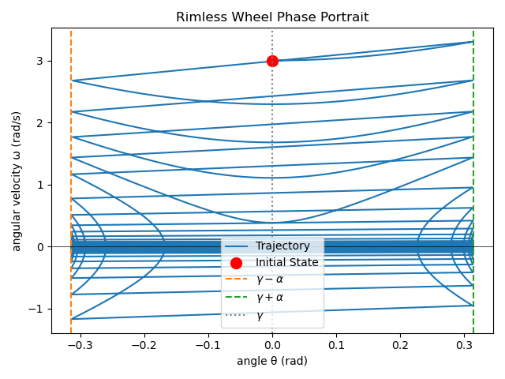

The model does not come to rest exactly, instead it "rocks" back forth as it triggers the impact continuously. 

While not immediately obvious from the graph, the final angular velocity never settles to zero. Instead the direction of angular velocity bounces continuously from positive to negative. I determined this when my initial attempt to determine whether a model was at rest by checking if its last angular velocity was 0 did not work. For this reason, detecting whether it is still rolling or at rest is based on whether or not the last few angular velocities have been in the same direction.

 If the direction of the angular velocities are all in the same direction -> the wheel is rolling in that direction.

 If the direction of the angular velocities are mixed (given that the simulation has run for long enough) -> the wheel is at rest.
 

 
---
 
## 2. State-Space Plot: RoA of Every Stable Attractor
 
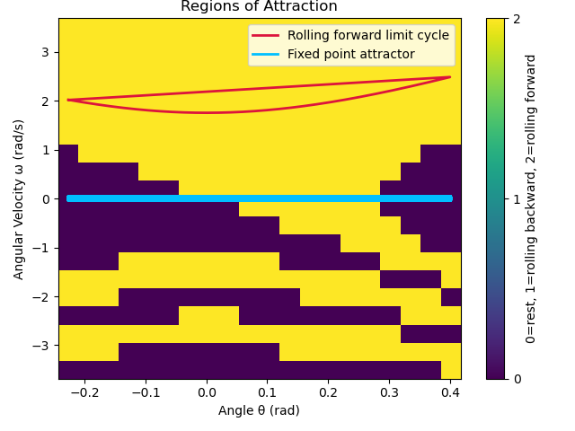

**Wheel Properties:** γ = 5°, N = 10
 
There are only two possible final states for this model: either at rest or rolling forward. Rolling backward is not possible as gravity continuously acts to bring it down the ramp and there is no restoring force adding momentum in the uphill direction. 

Rolling foward is a limit cycle. Rest is a stable attractor. 

How I plotted ROA: I detected whether it is still rolling or at rest is based on whether or not the last few angular velocities have been in the same direction. In the interest of time, this graph took 117 seconds to produce a 20 x 20 resolution ROA, even when stopping integration early when stability was detected.
 
---
 
## 3. 1D Poincaré Return-Map Plot
 
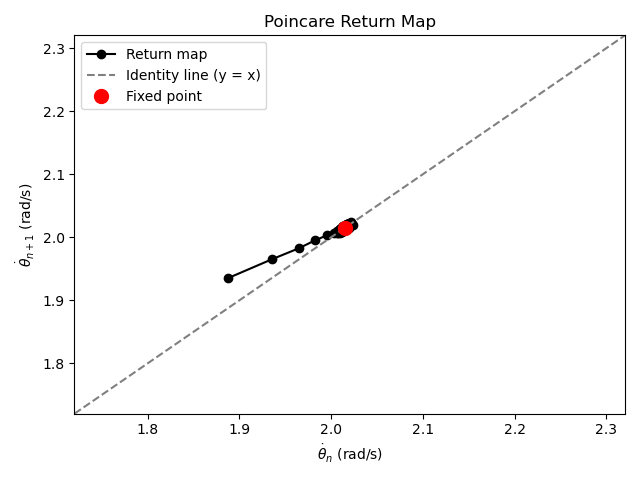
 
I determined the fixed point by running the wheel integration for a long time and taking the last measured angular velocity and theta as an estimation. While not a perfect estimate, it provides an idea of where the return map is converging/correcting to.
 
---
 
## 4. Effect of Incline Angle (γ) and Number of Spokes (N) on RoA and Local Convergence
 
### RoA vs. Number of Spokes (N), holding γ = 5°
 
| N = 6 | N = 9 | N = 12 |
|---|---|---|
|  | 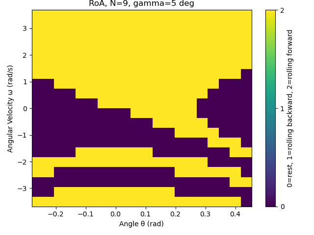 | 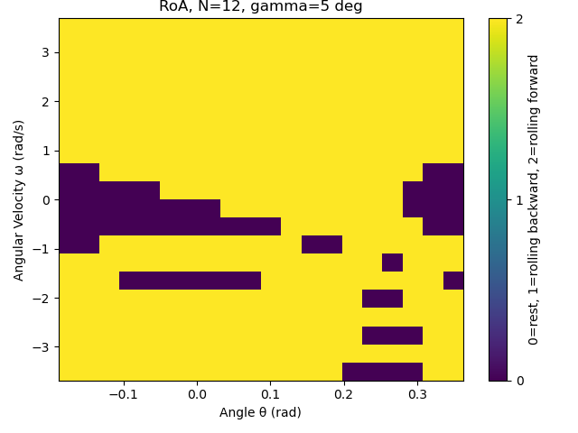 |
 
Theoretically, a wheel with an infinite # of spokes (N) is a ball which would always result in rolling foward if the inclination if non-zero. So the higher the # of spokes (N), the more likely it is to roll foward. This is evident from the increasing amount of state spaces settle out to rolling foward (more yellow points) when N is increased. 

N = 6 seems to result in nearly no wheel rolling forward. Because of the resolution however, there is a chance that the ball still rolls foward when initiated exactly with conditions on forward limit cycle but none of the test points were exact enough.

N = 9 displays "bands" of in the state space that result in rest, with lower initial velocities being more likely to result in the wheel stopping. There are more agres of the state space that result in rolling forward however, consistent with theory.

N = 12 seems to result many more of the state spaces rolling forward. It seems to mirror the pattern of N = 6, but the "bands" of rest are much thinner and thus the limited resolution of the graph does not pick up on all of these "bands" so it appears fragmented.

### RoA vs. Incline Angle (γ), holding N = 10
 
| γ = 0° | γ = 2.5° | γ = 5° |
|---|---|---|
| 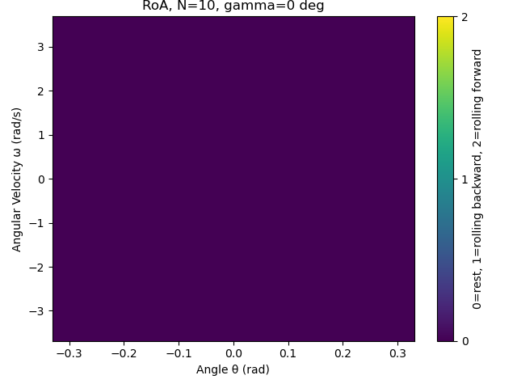 | 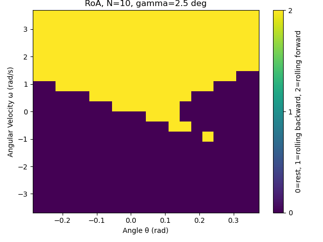 | 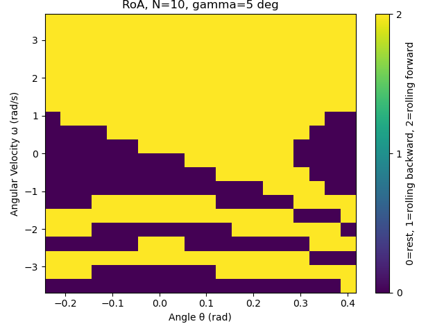 |
 
Theoretically, a incline with γ = 0° would always result in the wheel stopping. So the lower the # of angle, the more likely it is to stop. This is evident from the decrease amount of state spaces that resulting in stopping (more purple points) when γ is decreased. 

γ = 0° As expected, no wheel rolls can continously roll forward resulting in a state space that is entirely at rest.

γ = 2.5° As expected, mostly only the state spaces with initial positive angular velocities result in the wheel rolling forward.

γ = 5° As expected, more of the state space results in a wheel moving foward. The wheel can settle out to rolling forward even when started with a negative angular velocity because of the steepness of the incline.
 
### Floquet Multiplier vs. Number of Spokes / α

To ease in the calculation, the Floquet multiplier is determined by derivation linked [here](floquet_derivation.pdf) by taking the derivative of the relation between the angular velocity at the start of one "swing" and the start of the next "swing". This is the local slope of the return map at its fixed point. So by differentiating and evaluating at the fixed point, the derived equation for the multiplier is:

λ = cos²(2α)

This is only dependent on α, which is half the angle between the spokes. Thus, the Floquet multiplier is only dependent on the # of spokes N, not the inclination.
 
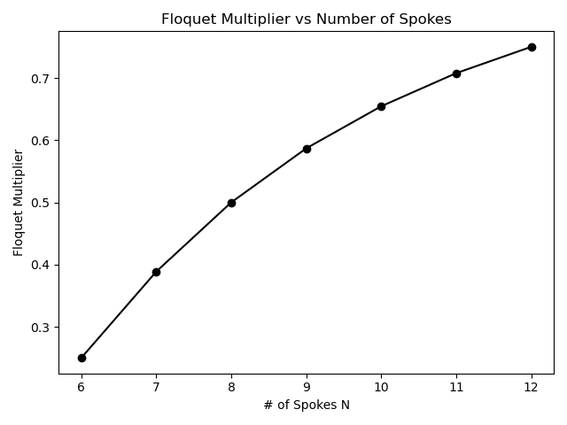

As the number of spokes increases, the Floquet multiplier does as well. Higher Floquet values closer to 1, mean there is slower correction to disturbances in the angular velocity per impact. With more spokes, there are more impacts per rotation, and each impact corrects the velocity distrubance towards stability less. But with more spokes this happens more frequently. As a result, the correction is "smoother" which makes sense because it is more like an actual wheel. 

 
### Floquet Multiplier vs. Incline Angle (γ)
 
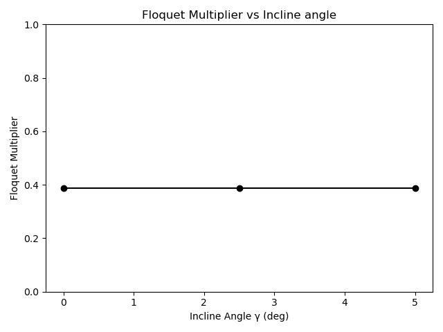
 
As the inclination changes, the Floquet multiplier does not. This is evident from the derivation seen above. This makes sense because the inclination can be thought of an external energy input (affects the gravity). It does not affect the rate at which the system recovers from disturbances.However, the loss of energy per rotation is dependent on the geometry (cos(2α)) from the elastic collision properties and does affect the rate at which the system recovers based on how often the impact occurs.

## 5. Appendix

### 1.) Floquet Multiplier Derivation

[PDF Linked Here](floquet_derivation.pdf)

