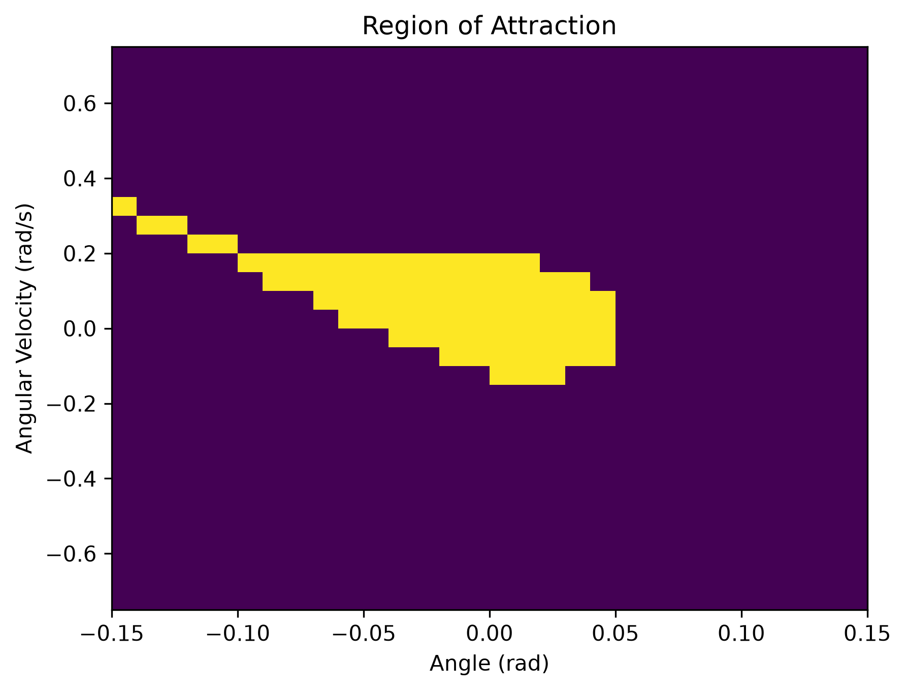
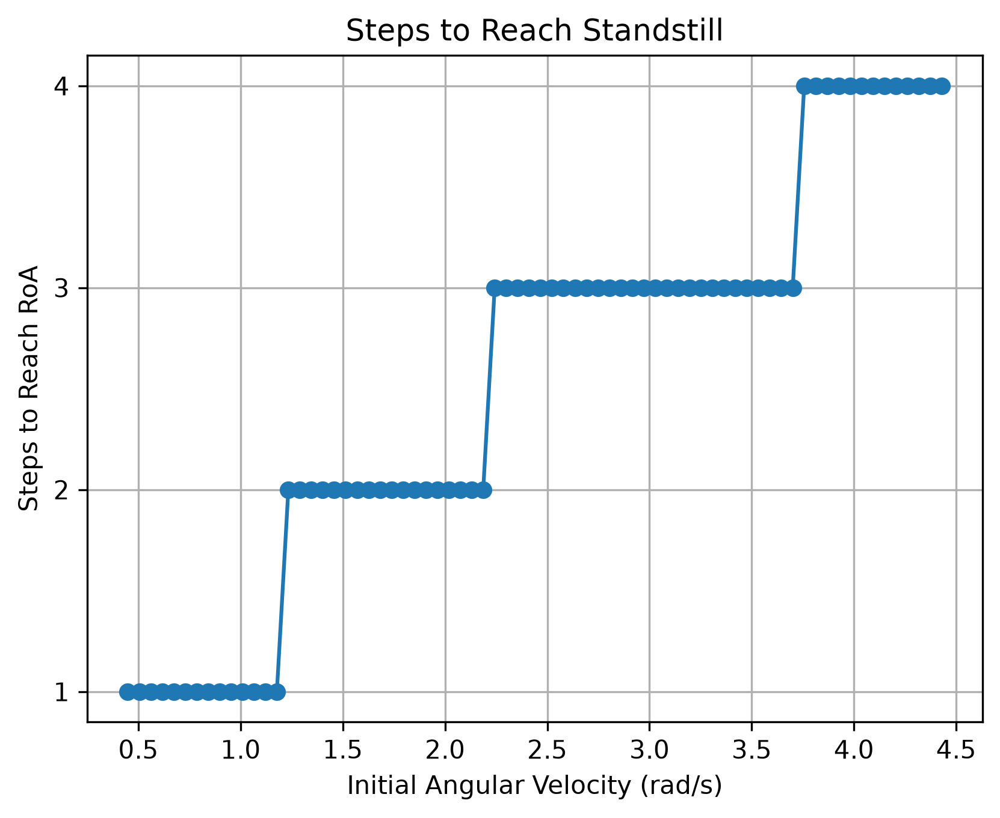
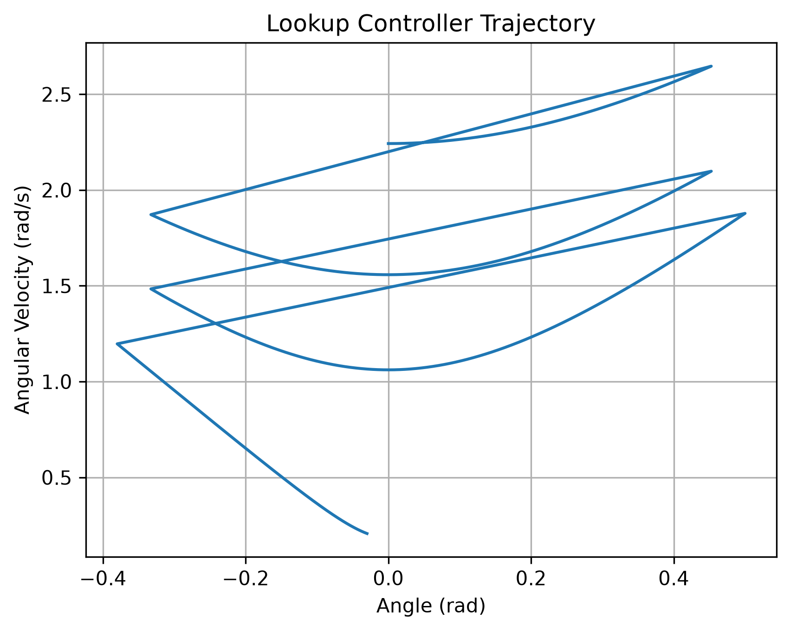

# Assignment 2: Inverted Pendulum Walker

## 1. Model and Controller Sketches

[Briefly describe the inverted pendulum walker model and the control approach.]

## 2. Ankle Controller and Region of Attraction

I implemented a feedback linearization controller using ankle torque to stabilize the walker around the upright equilibrium. I used a damping value of 1.0 and limited the ankle torque to the bounds specified in the assignment.

To determine the region of attraction (RoA), I tested a 30 × 30 grid of initial conditions over angles from -0.15 to 0.15 rad and angular velocities from -0.75 to 0.75 rad/s. An initial condition was classified as inside the RoA if the ankle controller successfully brought the angle and angular velocity close to zero.

## 3. Poincare Section

I selected the Poincare section

$$
\theta = 0,\qquad \dot{\theta} > 0
$$

Each walking step begins with the walker at a negative angle and ends at a positive angle, so the walker crosses $\theta=0$ during each successful forward step. Since $\theta$ is fixed at the Poincaré section, angular velocity is the only state needed for the discrete return map.

The section is also transverse to the flow during forward walking because $\dot{\theta}>0$ at the crossing.

## 4. Grid Resolution

I created a lookup table by sweeping initial angular velocities and possible angles of attack and recording the angular velocity at the next Poincaré crossing. I then worked backward from states that could reach the RoA to classify the number of steps required for each initial angular velocity.

| Grid Resolution | Maximum Grid Error (rad/s) | Maximum Steps |
|---|---:|---:|
| 30 | 0.0764 | 4 |
| 35 | 0.0651 | 4 |
| 40 | 0.0568 | 4 |
| 45 | 0.0502 | 4 |

Then I selected 40 points as the coarsest angular-velocity resolution. Increasing the resolution from 35 to 40 points shifted one of the step-transition boundaries by approximately 0.160 rad/s. In comparison, increasing from 40 to 45 points changed the transition boundaries by at most approximately 0.057 rad/s. The maximum predicted number of steps also remained at four.

Based on this comparison, 35 points was still too coarse, while the results began to settle by 40 points. For the final lookup table and trajectory simulations, I used a finer 80-point grid to further reduce nearest-grid-point error.

## 5. Steps to Reach Standstill

The following plot shows the number of walking steps required for each initial angular velocity on the Poincaré section to reach the region of attraction. Once the walker enters the RoA, the ankle controller can stabilize the walker and bring it to standstill.

## 6. Trajectory Requiring at Least Three Steps

I selected an initial condition from the lookup table that requires at least three walking steps to reach the region of attraction. At each Poincare crossing, the lookup table was used to select the angle of attack for the following step.

Initial angular velocity: **2.243 rad/s**

Lookup-table classification: **3 steps**

## 7. Maximum-Step Trajectory

Using the same initial condition, I searched the angle-of-attack values for the first two steps to determine whether a different control sequence could keep the walker walking longer before reaching the RoA. The longest trajectory found was still classified as three steps, using $\alpha=\pi/8$ for both of the first two steps.

Therefore, within this search, changing the angle-of-attack did not produce a longer trajectory than the original lookup-table trajectory.

Since the maximum-step search returned the same control choices as the original trajectory, the trajectory is the same as the previous section.