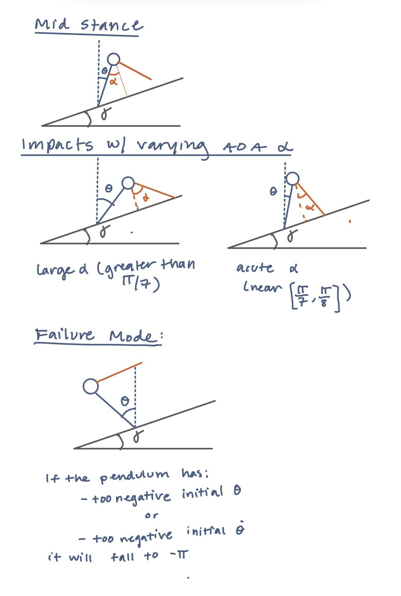

## Assignment 2 MAE 5510 - Anna Schaldenbrand
 
## How to Run
 
uv run python assignment_2.py

The code will print `"Assignment 2 script complete!"` when finished.

The writeup is called `assignment_2_writeup.md`.
 
## 1. Sketches

Need to add: the state space plots of the inverted pendulum, for each snapshot and identify where the system is, + sketch out the corresponding event guards as α changes.

## 2. Visualization of ROA

The region of attraction for the PD controller used. Yellow indicates the controller could successfully stabilize the inverted pendulum, while purple indicates the controller could not. 

A damping, Kd term of 2 N*m*s/rad, and a stiffness Kp term of 1 was used in the controller.

Stabilization is determined by if the end of the run time:
1. the angle θ is within a small tolerance (0.01 rad) from 0 rad
2. the angular velocity is within a small tolerance (0.01 rad/s) from 0 rad/s

The run time for each simulation was 5 s.

## 3. Choice of Poincaré section

A Poincaré section is a surface that the trajectory crosses transversally to be able to create a discrete snapshot of the dynamics at each crossing.

The rimless wheel's Poincaré section was chosen at touchdown, but the angle θ at touchdown was held constant since alpha (geometry) was fixed. 

However, this walker uses a varying alpha model. The touchdown Poincaré section is no longer ideal as theta is not fixed. Thus, touchdown no longer corresponds to a single fixed θ value.

Thus, the ideal choice for the Poincaré section is **when the trajectory passes through θ=0**. From the state space plots, all trajectories that are stepping foward will cross θ=0 transversally and just once per step, making it an ideal.

Note: this applies only during normal stepping. It will not be transverse if the angular velocity is 0.

## 4. Verification of grid resolution,

To determine the minimum grid resolution needed, I wanted to determine the lowest resolution at which the number of steps is accurate. I ran simulations for a variety of resolutions (grid sizes) and initial angular velocities (θ̇ ) to see what the results converged to.

| Resolution | θ̇ = 1.0 | θ̇ = 2.0 | θ̇ = 3.0 | θ̇ = 4.0 |
|---|---|---|---|---|
| 19x19 | 1.0 | 2.0 | 3.0 | 4.0 |
| 20x20 | 1.0 | 2.0 | 3.0 | 3.0 |
| 21x21 | 1.0 | 2.0 | 3.0 | 4.0 |
| 22x22 | 1.0 | 2.0 | 3.0 | 4.0 |
| 23x23 | 1.0 | 2.0 | 3.0 | 4.0 |
| 24x24 | 1.0 | 2.0 | 3.0 | 4.0 |
| 25x25 | 1.0 | 2.0 | 3.0 | 4.0 |

Seen above, the # of steps appears to converge at 21 x 21. The prior resolutions appear to be at/around the boundary leading to varying calculations of the number of steps. Thus, 21 x 21 was chosen as the resolution.

## 5. Sample Trajectory: 3 steps and max steps

The angle (θ) and angular velocity (θ̇ ) trajectory for an initial condition that requires at least 3 steps is shown above.

Additionally, the angle (θ) and angular velocity (θ̇) trajectory for an initial condition that requires the maxmimum amount of steps for the range of initial velocities is shown.

## 6. Steps needed to reach standstill

For a given inital condition (angular velocity, θ̇), this displays how many steps the walker takes to reach standstill. 

The number of steps rises as the initial angular velocity increases. This makes sense because higher initial angular velocities are harder to correct and would take more steps to get to standstill.